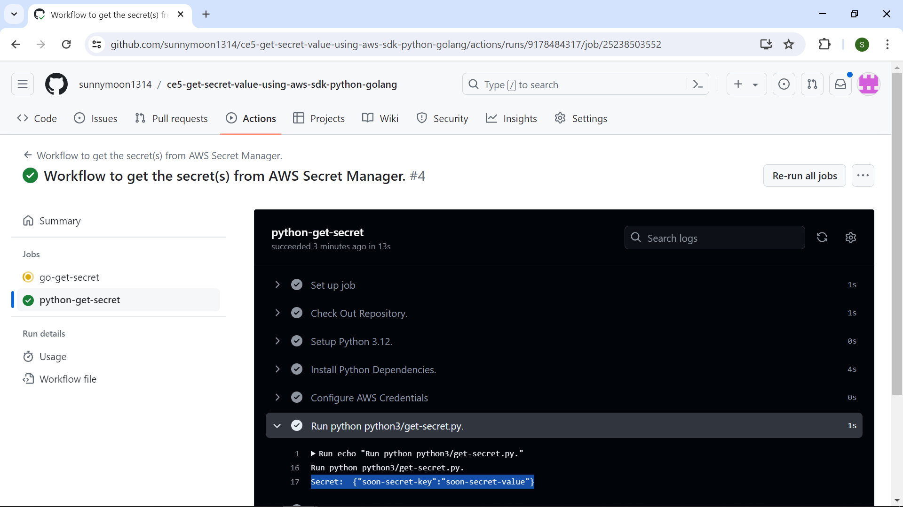

This repository contains the code samples to get the secret(s) created in AWS Secret Manager.

The secret name I created in AWS Secret Manager is called __soon-secret-name__. Please refer to the end of this file for the screenshot of the secret's details.

The code samples are written in these programming languages:
- Go
- Python3

Before running the codes, please configure the repository to have 3 secrets that store the credentials for authentication when you access the AWS Secret Manager via GitHub. 

To run the codes, please trigger the .github/workflows/get-secret.yml file via __workflow_dispatch__.

Expected output in all the runs should be:
Secret: {"soon-secret-key":"soon-secret-value"}

